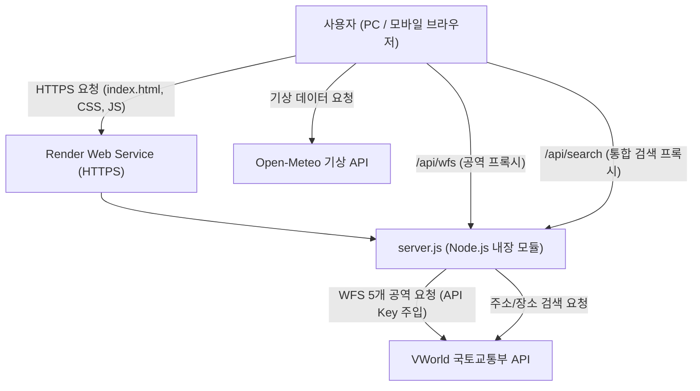

# 🚁 드론 안전 체크 (Drone Safety Check) — 프로젝트 마스터 명세서

> 문서 버전: 1.0.0 (STEP 3-24 기준)  
> 최종 갱신일: 2026-09-29

---

## 1. 프로젝트 비전 및 목표

* **목표**: 비행 전 드론 조종자(취미용, 사업용, 농업용 등)가 복잡한 인허가 규정과 비행 가능 여부를 한 번의 위치 선택으로 즉시 판정받을 수 있는 경량 고성능 웹 서비스.
* **핵심 가치**:
  * 외부 설치 프로그램 없이 브라우저(PC/모바일)에서 즉시 동작
  * 국토교통부 브이월드(VWorld) 5대 공역 및 오픈 기상 데이터 실시간 연동
  * 안전한 프록시 구조로 API Key 노출 방지
  * Zero-Dependency 순수 Node.js로 가볍고 신속한 배포

---

## 2. 시스템 아키텍처

---

## 3. 배포 구조 (Deployment Specification)

* **코드 저장소**: GitHub Public/Private Repository
* **호스팅 플랫폼**: Render Web Service
* **런타임 환경**: Node.js (>= 16.0.0)
* **네트워크 바인딩**: `0.0.0.0`, 포트는 `process.env.PORT`를 통해 Render가 동적 할당
* **빌드 명령어 (Build Command)**: `npm install`
* **시작 명령어 (Start Command)**: `npm start` (내부적으로 `node server.js` 실행)
* **CORS & 프록시**: `x-forwarded-host`, `x-forwarded-for` 지원 및 `*.onrender.com` 도메인 허용

---

## 4. 환경변수 규격 (Environment Variables)

| 환경변수명 | 필수 여부 | 기본값 | 설명 |
| :--- | :---: | :---: | :--- |
| `VWORLD_API_KEY` | **필수** | - | 국토교통부 브이월드 Open API 인증키 |
| `VWORLD_DOMAIN` | 선택 | `localhost` | 브이월드 인증키 등록 도메인 (Render 배포 시 `xxx.onrender.com`) |
| `PORT` | 선택 | `5500` | 서버 수신 포트 (Render 자동 부여) |
| `TRUST_PROXY` | 권장 | `false` | `true` 설정 시 리버스 프록시 뒤 클라이언트 IP 추출 |
| `ALLOWED_ORIGIN`| 선택 | - | 추가 허용할 CORS 도메인 |

---

## 5. 실행 및 운영 가이드

* **로컬 환경**:
  * Windows: `start.bat` 더블클릭 (자동 브라우저 실행)
  * 수동 실행: `npm start` 또는 `node server.js` (기본 포트 `http://localhost:5500`)
  * 종료: `stop.bat` 더블클릭 (포트 5500 프로세스만 타깃 종료)
* **클라우드(Render) 환경**:
  * GitHub 저장소 연동 후 대시보드에서 `VWORLD_API_KEY` 등록
  * 배포 완료 후 발급된 `https://<service-name>.onrender.com` 접속

---

## 6. 보안 정책

1. `.env` 파일은 절대 Git 및 외부로 유출하지 않는다. (`.gitignore` 적용)
2. 모든 외부 공역/검색 API 호출은 백엔드 프록시(`server.js`)를 거치며, 브라우저에는 API Key가 전달되지 않는다.
3. 인메모리 Rate Limit(60회/분), BBOX 크기 제한(최대 2.0도), 상위 디렉터리 접근 차단, 확장자 화이트리스트가 항상 작동한다.
